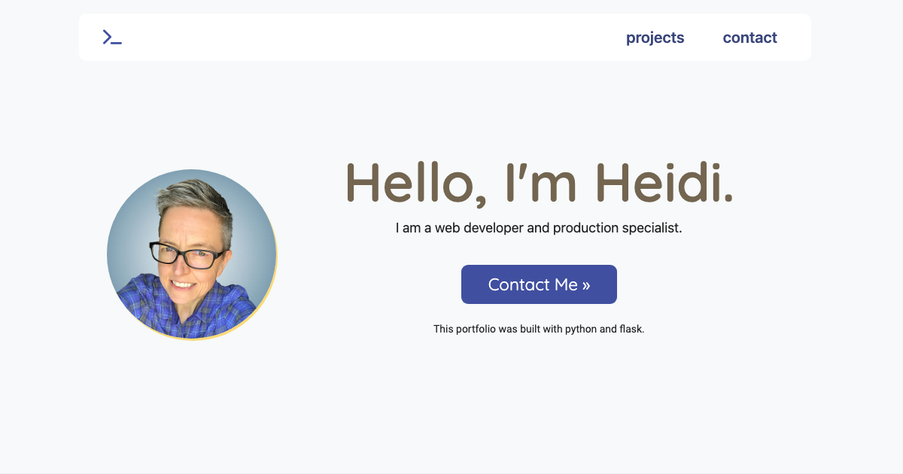

# My Python Portfolio



## Description:

In 2024 it was time for a portfolio refresh. I built my [2021 portfolio](https://heidifryzell.com/heidi-2021-portfolio/) as a static site using only HTML and CSS. For the new portfolio I still manually coded the HTML and CSS but this site is dynamically generated using Python and Flask. 

[Visit My Live Portfolio](https://heidis-python-portfolio.onrender.com/).

I know my portfolio could easily be a static site but I wanted to practice building a Flask app. Also I enjoy adding the portfolio projects by just adding another project dictionary to the data list.

```python
projects = [
  {
    "image": "/static/images/let-do-brunch-title-768x526.png",
    "name": "Let's Do Brunch!",
    "techs": ["python", "flask", "css", "bootstrap", "html", "sql"],
    "description": "This is my final project from the popular Harvard CS50 course taught by David Malan. It is a full stack app with sqlite database. The app allows users to plan a brunch and hopefully prevent too many people from bringing doughnuts.",
    "live": "https://heidi37.pythonanywhere.com/",
    "repo": "https://github.com/heidi37/cs50-final-project",
    "featured": True
  },
```


I also wrote a little bit of JavaScript and included the Bootstrap library to expedite the building of some components like the top navigation.

In this newer version on my portfolio I am featuring more applications that are dynamic. Some utilize databases while others pull data from API's.

### Tech Used:

      


## Run Code Locally:
1. Clone Repo to your machine
2. Navigate into cloned repo
3. Create a virtual envionment
```
python3 -m venv venv
```
⚠️ **Warning**: When I run this command I have to unblock the homebrew program in my anti-virus software


4. Activate virtual environment
```
source venv/bin/activate
```
(After activation, your terminal prompt should change to show the virtual environment’s name, e.g., (venv))

5. Install dependencies
```
pip install -r requirements.txt
```
6. Run the application locally
```
python3 app.py
```
7. When you are done working in the virtual environment deactivate it using the command:
```
deactivate
```
## Related Projects
<table border="1">
  <tr>
    <td style="text-align: center;"><a href="https://nature-journal.onrender.com/">Bird Journal App</a> | <a href="https://github.com/heidi37/bird-journal">Repo</a></td>
  </tr>
  <tr>
    <td><a href="https://nature-journal.onrender.com/"></a></td>
  </tr>
</table>

<table border="1">
  <tr>
    <td style="text-align: center;"><a href="https://heidi37.pythonanywhere.com/">Let's Do Brunch App</a> | <a href="https://github.com/heidi37/cs50-final-project">Repo</a></td>
  </tr>
  <tr>
    <td><a href="https://heidi37.pythonanywhere.com/"></a></td>
  </tr>
</table>
