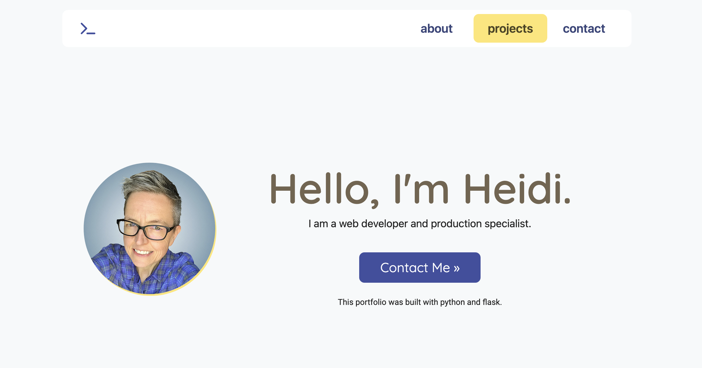

# My Python Portfolio



## Description:

In 2024 it was time for a portfolio refresh. I built my [2021 portfolio](https://heidifryzell.com/heidi-2021-portfolio/) as a static site using only HTML and CSS. For the new portfolio I still manually coded the HTML and CSS but this site is dynamically generated using Python and Flask. 

[Visit My Live Portfolio](https://heidis-python-portfolio.onrender.com/).

I know my portfolio could easily be a static site but I wanted to practice building a Flask app. Also I enjoy adding the portfolio projects by just adding another project dictionary to the data list.

```python
projects = [
  {
    "image": "/static/images/let-do-brunch-title-768x526.png",
    "name": "Let's Do Brunch!",
    "techs": ["python", "flask", "css", "bootstrap", "html", "sql"],
    "description": "This is my final project from the popular Harvard CS50 course taught by David Malan. It is a full stack app with sqlite database. The app allows users to plan a brunch and hopefully prevent too many people from bringing doughnuts.",
    "live": "https://heidi37.pythonanywhere.com/",
    "repo": "https://github.com/heidi37/cs50-final-project",
    "featured": True
  },
```


I also wrote a little bit of JavaScript and included the Bootstrap library to expedite the building of some components like the top navigation.

In this newer version on my portfolio I am featuring more applications that are dynamic. Some utilize databases while others pull data from API's.

[Visit My Python Portfolio](https://heidis-python-portfolio.onrender.com/)
